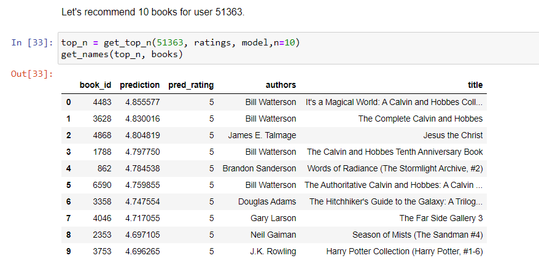

# Book recommendation system
<p align="center">

</p>

*If you don’t like to read, you haven’t found the right book* - J.K. Rowling

## Project description
The goal of this project is creation of books recommendation system.
I compared different models and collaborative filtering approaches to find the best solution.

## Installation
This project is written in Python 3.8.3.
The `requirements.txt` file contains all required Python libraries. They can be installed using:
```
pip install -r requirements.txt
```

## Dataset

[Goodbooks-10k](https://github.com/zygmuntz/goodbooks-10k) - only books.csv and ratings.csv are used in this project.

## Results

The best [RMSE](https://en.wikipedia.org/wiki/Root-mean-square_deviation) and [MAE](https://en.wikipedia.org/wiki/Mean_absolute_error) were achieved by SVD - we want to minimalize these values. All models are better than random approach.

| Model | RMSE | MAE |
| --- | --- | --- |
| Random   |	1.321724 |	1.051821 |
| KNNBasic user_based	| 0.951170 |	0.760192 |
| KNNBaseline user_based |	0.853463 |	0.671673 |
|	KNNWithZScore user_based |	0.855638 |	0.665709 |
|	KNNWithMeans user_based |	0.857791 |	0.668161 |
|	KNNBasic item_based |	0.888497 |	0.696982 |
|	KNNBaseline item_based |	0.856132 |	0.668380 |
|	KNNWithZScore item_based |	0.866092 |	0.677739 |
|	KNNWithMeans item_based |	0.864491 |	0.676945 |
|	SVD |	0.845166 |	0.663349 |

## Example


